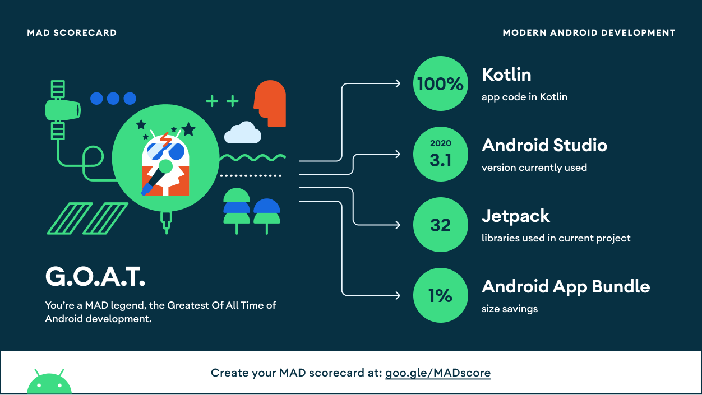

# Cat Dog application

Application to test the Cat and Dog APIs, and test different libraries within the Android Jetpack
suite. Architecture approach inspired by DDD and CLEAN concepts.

Currently the app is only implementing the Dog Api in the screens.

## Screens 📱

The app currently consists of 2 screens:

- A list of dogs breeds screen, in which once the user enters de app, they can visualize a list of
  dog breeds taken from the API, they can select one and they also count with a filter button in
  case they want to see a list of all the breeds and choose one.
- A breed detail screen, in which after selecting one breed from the list, the user can visualize
  detailed information from said breed, like their breed group, span life or what they are breed
  for.

## Libraries 🛠️

- [Flow](https://developer.android.com/kotlin/flow)
- [Dagger Hilt](https://dagger.dev/hilt/)
- [Coil](https://coil-kt.github.io/coil/)
- [Android Jetpack](https://developer.android.com/jetpack)
    - [Navigator](https://developer.android.com/guide/navigation/navigation-getting-started)
    - [View Binding](https://developer.android.com/topic/libraries/view-binding)
    - [ViewModel](https://developer.android.com/topic/libraries/architecture/viewmodel)
    - [Lifecycle](https://developer.android.com/topic/libraries/architecture/lifecycle)
- [Retrofit](https://square.github.io/retrofit/)
- [Moshi](https://github.com/square/moshi)
- [Lottie](https://github.com/airbnb/lottie-android/)
- [Why Not! Image Carousel!](https://github.com/ImaginativeShohag/Why-Not-Image-Carousel/)

## Structure 🎨

- __App__:
    - __DI__: the dependency injector package, where the modules are created.
    - __UI__: with an MVVM pattern, everything is separated as features, the screens and logic
      behind them are found here.
- __Data__: Contains the repositories Implementations and one or multiple Data Sources.
    - __DataSource__: In which we have the source of the data we are going to work with, let it be
      the API abstraction, and/or the database.
    - __Repositories__: The repositories implementation that are responsible to coordinate data from
      the different Data Sources. A sort of abstraction for the data sources in order to avoid
      working directly with them. We make calls to them and we can ignore whether the data comes
      from the network or a local database.
- __Domain__: Collection of entity objects and related business logic that is designed to represent
  the enterprise business model.
    - __Models__: An abstraction of the objects that represent the logic of the project.
    - __Repository__: The abstraction of the repositories to be implemented in the Data module.
    - __UseCases__: The interactors that represent the business logic of the application
- __Core__: Collection of utilities, classes, extensions, and helpers to use across the project,
  that not necessarily have anything to do with the logic of the same.

## Testing 🧪

- JUnit
- [Mockk](https://mockk.io/)
- [Kluent](https://markusamshove.github.io/Kluent/)

## Screenshots 📸

## MAD ScoreCard 👾

[Link to MAD Scoreboard](https://madscorecard.withgoogle.com/scorecard/share/1756627335/)

